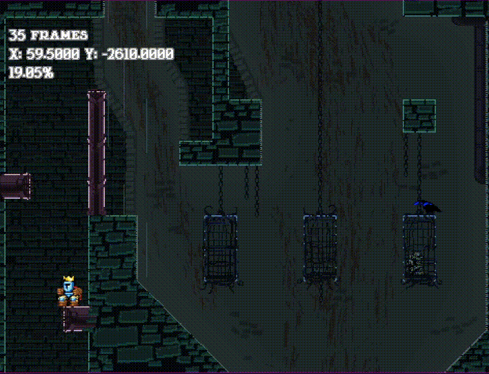
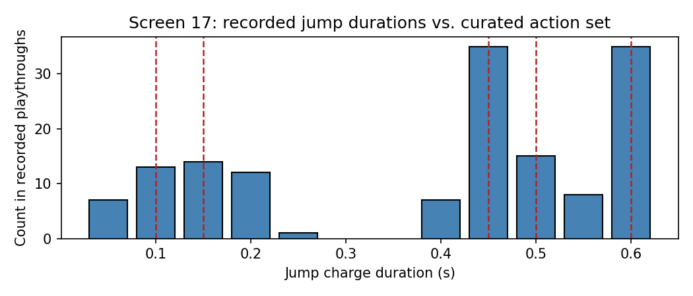
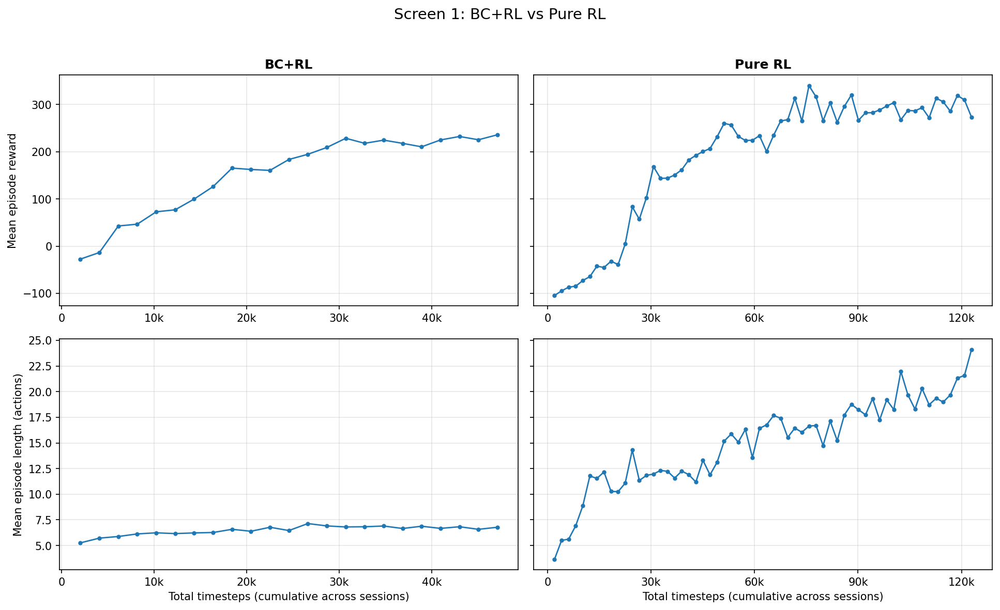
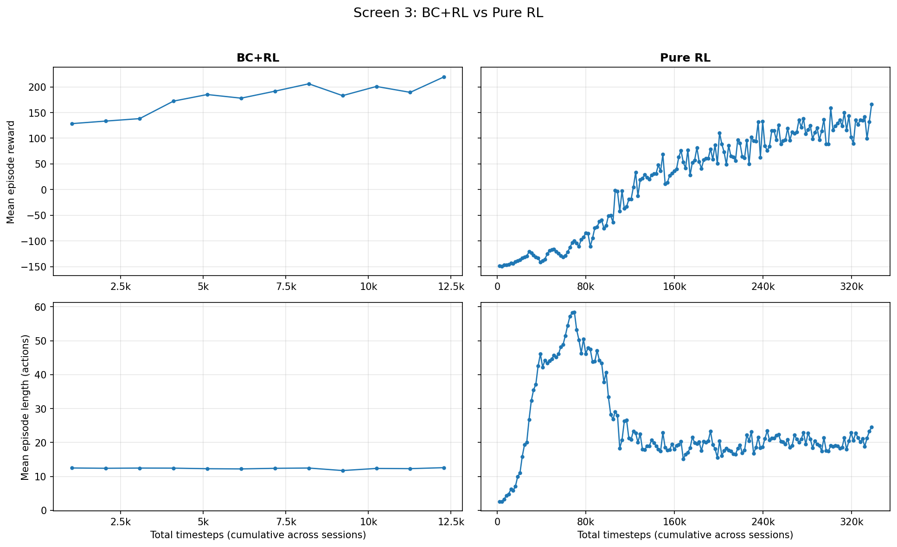
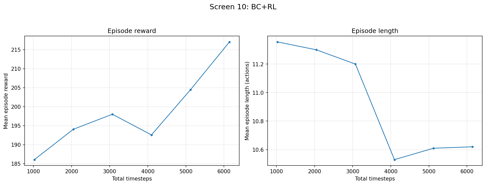
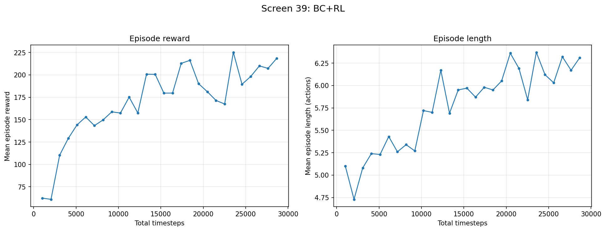
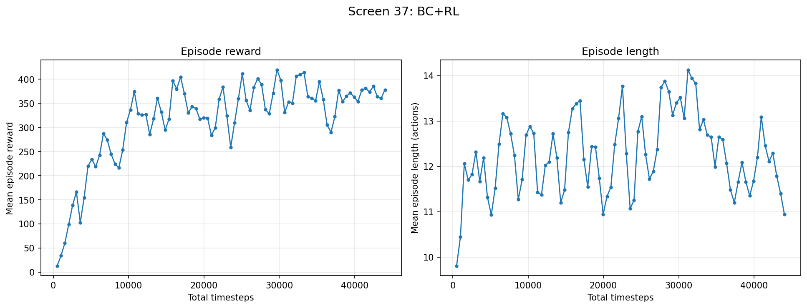

# Repo Organization
 
At a high level: the C# mod runs inside Jump King and streams live game state to Python over a TCP socket. The Gymnasium environment converts that state into a representation the agent can use, selects an action via a BC, RL, or BC+RL model, and sends the corresponding input back to the game. `JumpKingRL` manages model creation, training, and switching across screens.
 
**Entry point**
- `JumpKingRL.py` - The entry point to the project. A class-based management system for creating, modifying, and deleting BC, RL, and BC+RL models, and for running per-screen training.

**Core loop**
- `JumpKingEnv.py` - The Gymnasium environment, including the `step()` and `reset()` functions. Also holds reward logic, action space generation, and episode termination logic.
- `GameStateReceiver.py` - Handles the TCP socket communication between the C# mod and Python, exposing the latest game state to the environment. Also sends teleport commands to the mod.
- C# mod (`JumpKingMod.cs` and supporting files) - Runs inside Jump King, extracts live game state (position, velocity, screen, wind timer, and more) via reflection, and streams it to Python over TCP. Supporting files: `ActionKeylogger.cs` (records human inputs for BC), `PlatformScanner.cs` and `SlopeScanner.cs` (scrape tile/platform geometry), `TeleporterBehavior.cs` (executes teleport commands), and `WindCycleRecorder.cs` (records the wind cycle).

**State and data processing**
- `PlatformParser.py` - Ingests raw tile data and determines platform positions for use in state representation.
- `GeneratePlatformIDs.py` - Generates platform IDs for state representation on wind screens.
- `RecordingParser.py` - Ingests human playthrough data and produces the states and action spaces used to construct BC models.

**Learning**
- `BehavioralCloning.py` - A PyTorch MLP that trains BC agents from human playthrough data, plus the weight-transfer step that initializes PPO from a trained BC network.

**Configuration and analysis**
- `static_variables.py` - Holds unchanging values such as teleporter start positions and per-screen action space definitions.
- `Analysis.py` - Analysis utilities: concatenating training data across sessions, evaluating trained models over many episodes, and plotting/data-analysis functions.

# Introduction

### Game Description

Jump King is a vertical 2D platformer where the goal is to progress upwards by moving left and right (using the arrow keys), and jumping (using the spacebar) (Jump King, 2019). The longer the player holds down the spacebar (up to a 0.5833s duration), the farther they jump. The control scheme is simple, but mastering it requires precisely timing how long the spacebar is held. Some jumps have lenient timings, and others are precise, at $\approx$ 0.05s. When the player jumps beyond their current screen, they progress to the next screen. Environmental difficulty increases as the player progresses. Some platforms are made of ice, causing the player to slide along them when landing, while other screens contain wind, which affects player movement both on the ground and in the air.

### RL Background

Reinforcement learning (RL) is a subfield of machine learning in which an agent learns to solve a problem through trial and error. At each timestep $t$, the agent observes a state $s_t$, selects an action $a_t$, and receives a reward $r_t$. The mapping from states to actions is called a policy, denoted $\pi$. A sequence of states and actions from an initial state to a terminal state is called an episode. Over many episodes, the agent learns to adjust $\pi$ to maximize expected reward. A key property of the policies considered is that they are memoryless. That is, $\pi(a|t)$ only depends on the current state, with no explicit memory of previous states or actions within the episode. In other words, the agent decides each move looking only at the current situation, not at how it got there. I use proximal policy optimization (PPO) (Schulman, 2017), a general-purpose RL algorithm requiring minimal domain-specific tuning, which is applicable to both discrete and continuous action spaces. It is also compatible with weight initialization from a separately trained network, which is the property that makes the behavioral cloning step below possible.
 
Behavioral cloning (BC) is a form of imitation learning. Instead of discovering good actions through trial and error, the agent learns by copying examples of a human playing, where each state is mapped to the action a human took. Each moment of recorded play pairs a state (a machine-readable description of the environment) with an action the human took, and the agent learns to reproduce those choices. On its own, BC struggles if it encounters a situation the human never demonstrated. But as a starting point to RL, it is invaluable, as it spares the agent from having to stumble onto reasonable actions by chance. This gives the agent a head start before RL refines its behavior. Concretely, I can train the BC network first and then continue training it with RL, since PPO's compatibility with parameter sharing and weight initialization lets me copy the trained BC weights directly into PPO's policy network, so RL begins from competent behavior rather than from scratch.

### Project Description

I created a reinforcement learning (RL) agent to play and complete Jump King. I built a full pipeline from scratch: real-time game-state extraction from the live commercial game via a custom C# mod (using dnSpy decompilation and the game's modding API) communicating with Python over a TCP socket, a custom Gymnasium environment with per-screen state/action processing, PPO (proximal policy optimization) with behavioral-cloning weight transfer, per-screen reward shaping, and a class-based model-management and evaluation system.

Jump King is deterministic in theory, but its physics engine can't be perfectly simulated from outside the game without a full recreation, making planning intractable. It's a game that looks like it should be plannable, but isn't. This makes it an interesting testbed for comparing learned approaches like RL, BC, and hybrid methods.

*Trained BC+RL agent playing Jump King, screens 8-9*

### Previous Work

Prior work on Jump King is limited to informal efforts outside RL research. Code Bullet applied an evolutionary algorithm to a from-scratch JavaScript re-implementation of Jump King (Code Bullet, 2022a), completing the game (Code Bullet, 2022b). His approach was an open-loop evolutionary strategy, in which agents played through the game with predetermined action sequences. The best performing agents were used to produce more accurate agents in future generations. While this approach is similar to RL in that it learns through trial and error, it runs on a reimplementation, and does not use neural networks or learned state representations to decide actions in real time.

# Architecture

### Overview

I built a custom C# mod that interfaced with Jump King and provided live game data to Python via TCP socket communication. I used existing Jump King documentation for modding, reflection to access metadata, and dnSpy to identify relevant objects. Mod features included reporting game data such as position, velocity, jump duration, and a wind timer; a keylogger that tracked player actions; a tile data scraper that collected platform information; and a teleporter that transported the player back to specified coordinates. The C# to Python TCP socket writes data each frame, and the most recent data is used for state calculation following action selection.

I used two Windows laptops to develop and train agents. One was dedicated entirely to training and ran continuously for several months, training both BC+RL and pure RL agents; the other was my development machine, where agents were trained overnight and while it was idle. This two-machine split matters later: a handful of timing-sensitive screens turned out to converge differently depending on which machine trained them, so which hardware trained an agent becomes a key factor in the convergence results discussed in the Results section.

# Methods

Each agent is trained on a separate screen. Jump King's base game has 43 screens total, which are indexed starting at 0. Therefore, 43 separate BC+RL agents are trained total, and are then chained together sequentially to complete the full game. When the agent jumps to the next screen or falls to the previous one, the agent associated with that screen is loaded.

### Steps:

The following steps are repeated until the agent takes a set number of actions or is interrupted:

1. Game data is read in each frame by a custom C# mod
2. The game data is transferred to Python via a TCP socket
3. Game data is converted to a state interpretable by the custom Gymnasium environment and passed to the agent
4. The agent selects an action
5. The action is mapped to game input via the pydirectinput package
6. Wait for the agent's action to complete (walking, jumping, no-op), then re-read game data
7. Compute the reward from the new game state and provide it to the agent

### State Representation

Most screens started with the following state: `[x, y%360, ceiling, left_wall, right_wall, rel_x_start, rel_x_end]`, where `x` and `y` are the position of the player, `ceiling` is the distance to the ceiling, `left_wall` and `right_wall` are the distances to each wall respectively, and `rel_x_start` and `rel_x_end` are the relative differences to the left and right edge of the platform the player is currently standing on. Distance-based calculations were performed by collecting individual tile data from Jump King using the custom C# mod, merging them into platforms, then computing Euclidean distances from the player to each surface.

If convergence failed using the above state, screen-specific geometry was analyzed to determine a more appropriate representation. For example, screens with ice platforms, which cause the player to slide on landing, required tracking x velocity, while screens with cyclical wind patterns required adding a timer tracking the cycle to the state data. Furthermore, I observed small discrepancies in tile data on several screens which corrupted state representation. Thus, a simpler, platform-agnostic state representation of `[x, y%360]` was used for several screens.

My state representation induces POMDP-like ambiguity (the agent cannot fully observe the true game state) even though the underlying game is an MDP at its core. This is for two reasons. First, adding variables to the state increases the time it takes the models to converge, so it's necessary to use the smallest state required for convergence given the live-game environment. And second, the bias-variance tradeoff causes the agent to fail to learn if a state is too general, and fail to generalize if a state is too specific.

### Action Spaces

Each action in the action space is represented as a tuple describing an input to Jump King, structured like `(left_arrow, right_arrow, spacebar)`, where `left_arrow` and `right_arrow` are durations the left and right arrows are held down, and `spacebar` is the duration the spacebar is held down. Durations vary between 0.05 and 0.5833 seconds, where holding down spacebar for 0.5833s corresponds to the maximum jump height.

Action spaces vary enormously between screens. For simpler screens, like screen 0, only four actions were necessary for completion: (0.2, 0, 0), (0, 0.2, 0), (0.5833, 0, 0.5833), and (0, 0.5833, 0.5833). Or more simply: a short walk in both directions, and a max jump in both directions. For more complicated screens, like screen 17, a combination of small, medium, large, and max jumps were required, totaling to 14 actions. Nearly every screen included four walk actions: 0.1s and 0.2s in both directions. A walk duration of 0.2s was used to cover larger distances, and a walk duration of 0.1s was used for more precise positioning.

Action spaces were selected based on the action frequency distribution according to human playthrough data. In the figure below, I display a plot showing a histogram of human actions on screen 17 is displayed, with jump duration on the x axis and count on the y axis. The dotted red lines are actions selected for the action space. For this screen, I snapped jump durations to increments of 0.05, then selected the fewest number of actions needed to complete the screen. Crucially, to isolate the effect of BC initialization, pure RL and pure BC use the same curated action space as BC+RL. This holds the action space constant across all three models, so differences in performance reflect the learning method rather than differences in available actions. Note that the curated action space is itself derived from demonstration data, so even pure RL inherits some benefit from human play.

### Reward Signals

Reward magnitudes were tuned empirically over the course of the project as my understanding of the state and action space matured. The scoping column indicates where each term applies under the final scheme. Note that "wind" refers to screens 25-31, and "ice" refers to screens 36-38. Some reward terms differ between the BC+RL and pure RL agents; the scope column notes where. The table below lists the reward scheme:

| Type | Description | Value | Scope |
|---|---|---|---|
| Screen completion | On progressing to the next screen | 150 | non-wind
| Screen failure | On falling to a previous screen | -150 | non-wind
| Height change | Any time height changes | (new_y - old_y)/5 | all
| Action cutoff | Actions in one episode exceed the cutoff (100 for non-wind screens, 250 for wind screens) | -200 | all
| Speed reward | Higher reward for completing a screen in fewer actions | 100/num_actions | all
| Wind screen completion | On progressing to the next screen | 500 | wind
| Wind screen failure | On falling to a previous screen | -300 | wind
| Stabilizing jump | Performing a tiny jump in the direction opposite to velocity when landing on an ice platform | 15 | ice
| New platform reached | Awarded when landing on a new platform (once per episode) | 30 | BC+RL: ice, RL: all
| Proximity to goal | Based on distance from goal | Difference between Euclidean distance of new and old position to goal (first landable space on next screen) | BC+RL: none, RL: all

Which signals were active varied by screen and across the project as the reward design matured. Earlier screens were trained under prior iterations, and signals like platform and proximity rewards were applied selectively where a screen needed them. 

### Episode Termination

Episodes were terminated on screen transition, or if the agent hit an action limit. The action limit was set to 100 for non-wind screens, and 250 for wind screens. At episode termination, the agent was teleported back to their training screen via a custom C# mod (see the next subsection for details). Starting locations for each screen were recorded during human playthroughs, and stored in a dictionary for dynamic access. 

### BC Training and Weight Transfer to RL models

As part of the C# mod described above, I collect live game data for use in BC training. This raw data is transformed into state-action pairs by categorizing the data by screen, binning the actions using the histogram-like approach described above, rounding non-selected actions to the nearest selected action, and building state representations for each action.

The BC NN is a 3-layer MLP with a hidden dimension of 256, an 80/20 train/test split, Adam optimization, and 100 epochs of training. Last, I transfer the learned BC weights into PPO by copying the two hidden layers and the output layer into PPO's policy network (the shared MLP extractor and the action head).

#### RL-Specific Parameters

For most screens, the following RL hyperparameters were used: 

| Parameter | Description | Value | Reason
|---|---|---|---|
|n_steps|The number of actions performed before each policy/value update|2048|A batch size large enough to keep gradient estimates stable. At ~0.5-1 actions/second, this meant 1 update approximately every hour|
|ent_coef|Weights an entropy bonus that discourages the policy from becoming overly deterministic, encouraging exploration.|0.05|We keep this fairly high to encourage exploration|
|target_kl|A threshold that stops training early if the new policy diverges too much from the old policy|0.02|Empirically adjusted based on agents getting stuck in local maxima|
|learning_rate|Controls step size during gradient descent|0.0001|Hand-tuned when training plateaued|

Other screens occasionally used different hyperparameters. For example, on wind screens (25-31), I used an ent_coef of 0.25 due to no-op class domination. 

#### Evaluation

To measure performance, I run each trained agent for 500 episodes on a given screen and record the outcome of each. An episode counts as a success if the agent progresses to the next screen, and a failure if it falls to the previous screen or hits the action timeout (100 actions for non-wind screens, 250 for wind screens). Completion rate is then successes/500.

At evaluation time, actions can be selected in one of two ways. Under deterministic (greedy) evaluation, the agent always takes its single highest-probability action for the current state. Under stochastic evaluation, the agent samples an action from its full probability distribution, so lower-probability actions are still taken occasionally. The evaluation mode is a property of the screen, not the agent: each screen is fixed to one mode, and every model evaluated on that screen (BC+RL, BC, and pure RL) uses the same mode so models can be compared on equal footing.

I use deterministic evaluation by default and set a screen to stochastic in two situations: where the agent converged but the correct action doesn't become the single most-likely one, so greedy selection never takes it; and where greedy selection sends the agent into a repeating loop, for example, on screen 19, where the agent can get stuck jumping into a wall by taking the otherwise-correct action about five pixels off from the correct spot. These screens are run stochastically during full-game playthroughs as well, so evaluating them the same way measures the agent under the exact selection mode it's actually deployed with. Furthermore, because the state representation is partial (the POMDP-like ambiguity noted earlier, state loses real environmental information), two distinct situations can appear near-identical to the agent, so the single highest-probability action is sometimes wrong for the situation it's actually in. Sampling lets the agent escape loops that greedy selection would repeat indefinitely. This is why stochastic evaluation is sometimes necessary in a deterministic game.

Deterministic evaluation is worth understanding in its own right, because it's central to interpreting the pure RL results later. Under greedy selection, a screen is completed only if the correct action is the highest-probability one at every decision point along the path. A single point where a wrong action outranks the right one caps completion there, and because the selection is deterministic, the agent will fail at the same spot on every attempt. This is why a pure RL agent can appear to "almost" solve a screen while still completing it 0% of the time: it plays the same partial solution every run, and gets stuck at the first decision point it never learned.

# Results

I choose a sampling of screens across the base game that represent a diverse set of action spaces, reward signals, environmental hazards, difficulty, and overall performance:
- Screen 0 is the first and easiest screen in the game. It is impossible to fall.
- Screens 1 and 3 are early and low difficulty
- Screen 8 requires the player to move downwards in order to progress
- Screen 10 has a large number of platforms, many of which are not used on the optimal path. It was included to test whether the agent would wander into states absent from human demonstrations (a known drawback of BC). In practice this rarely occurred.
- Screen 16 has the most precise jump in the game (~0.05s window)
- Screen 17 has the largest action space of any screen in the game
- Screen 26 is a wind screen
- Screens 30 and 31 have two of the most diverse state representations
- Screens 36, 37, and 38 are all ice screens, with 37 being the most difficult screen in the game for an agent
- Screens 38 and 41 have minor tiling discrepancy issues

For both pure BC and pure RL models, the same action space is used to minimize differences across models and provide cleaner comparisons. In addition, I trained pure RL models on a smaller subset of screens due to the length of time it takes to train them. 

#### Completion Rate

Below, a table for the completion rate percentages compared between BC+RL, BC, and RL models is displayed. Completion rate is calculated as the percentage of the time the agent progressed to the next screen (successes/500). 

| Screen | BC+RL | BC | RL |
|---|---|---|---|
| 0 | 100 | 76.0 | 100 |
| 1 | 100 | 0.6 | 100 |
| 3 | 100 | 94.0 | 95.2 |
| 8 | 98.0 | 99.0 | 0.0 |
| 10 | 100 | 98.6 | not evaluated |
| 16 | 94.6 | 0.0 | 0.0 |
| 17 | 87.8 | 0.0 | not evaluated |
| 26 | 81.0 | 29.2 | 0.0 |
| 30 | 100 | 100 | not evaluated |
| 31 | 100 | 82.4 | not evaluated |
| 36 | 84.4 | 33.0 | 0.0 |
| 37 | 77.8 | 0.0 | not evaluated |
| 38 | 84.6 | 57.6 | not evaluated |
| 41 | 92.0 | 50.2 | not evaluated |

#### Completion Time

Next, I display a table comparing completion times between each model. Completion time is calculated as the average time it takes to progress to the next screen. There are two important notes to make. First, completion time is only reset on successes, not on failures. Without this modification, only times on successful episodes would be factored into average completion time, which biases the data in the agent's favor and makes its metrics appear better than its actual performance. Second, due to hardware and OS-level timing sensitivities, only data out to one decimal place is shown, as this is the most certain I can be.

| Screen | BC+RL | BC | RL |
|---|---|---|---|
| 0 | 5.0 ± 0.0 | 29.2 ± 26.4 | 4.6 ± 0.0 |
| 1 | 7.2 ± 0.8 | 921.6 ± 1079.3 | 6.8 ± 0.8 |
| 3 | 8.4 ± 0.8 | 9.3 ± 3.2 | 9.2 ± 3.6 |
| 8 | 10.0 ± 1.7 | 9.9 ± 1.1 | no successes |
| 10 | 8.7 ± 0.3 | 9.0 ± 0.3 | not evaluated |
| 16 | 15.0 ± 1.6 | no successes | no successes |
| 17 | 13.5 ± 2.8 | no successes | not evaluated |
| 26 | 31.0 ± 14.6 | 119.9 ± 119.2 | no successes |
| 30 | 24.8 ± 0.4 | 24.9 ± 0.1 | not evaluated |
| 31 | 11.8 ± 1.4 | 14.3 ± 5.4 | not evaluated |
| 36 | 11.5 ± 7.0 | 38.6 ± 30.5 | no successes |
| 37 | 10.6 ± 3.9 | no successes | not evaluated |
| 38 | 9.8 ± 4.0 | 11.7 ± 6.9 | not evaluated |
| 41 | 7.5 ± 1.5 | 10.4 ± 7.8 | not evaluated |

#### Completion Actions

Below, a table for the number of actions it took on average to complete each screen is displayed. Similar to the completion time metric, the action counter is only reset on success, not on failure. 

| Screen | BC+RL | BC | RL |
|---|---|---|---|
| 0 | 5.00 ± 0.00 | 65.30 ± 65.35 | 4.00 ± 0.00 |
| 1 | 6.01 ± 1.28 | 722.0 ± 858.61 | 5.34 ± 0.57 |
| 3 | 12.27 ± 1.10 | 13.95 ± 4.34 | 11.35 ± 5.48 |
| 8 | 10.43 ± 1.48 | 10.38 ± 1.05 | no successes |
| 10 | 9.92 ± 0.83 | 11.80 ± 0.89 | not evaluated |
| 16 | 14.64 ± 1.40 | no successes | no successes |
| 17 | 16.72 ± 2.16 | no successes | not evaluated |
| 26 | 94.89 ± 36.57 | 367.14 ± 362.16 | no successes |
| 30 | 83.83 ± 1.92 | 84.00 ± 0.81 | not evaluated |
| 31 | 23.72 ± 2.97 | 30.46 ± 14.18 | not evaluated |
| 36 | 10.98 ± 2.90 | 23.07 ± 16.24 | no successes |
| 37 | 12.63 ± 3.54 | no successes | not evaluated |
| 38 | 10.50 ± 4.79 | 11.02 ± 6.07 | not evaluated |
| 41 | 7.51 ± 1.30 | 8.52 ± 3.97 | not evaluated |

#### Timesteps to Converge

Last, I display a table for the number of timesteps it took for each screen to converge.

| Screen | BC+RL | RL |
|---|---|---|
| 0 | 10240 | 104448 |
| 1 | 43008 | 118784 |
| 3 | 8192 | 337920 |
| 8 | 26624 | did not converge |
| 10 | 6144 | not evaluated |
| 16 | 57344 | did not converge |
| 17 | 24576 | not evaluated |
| 26 | 77824 | did not converge |
| 30 | 10240 | not evaluated |
| 31 | 8192 | not evaluated |
| 36 | 23552 | did not converge |
| 37 | 16896 | not evaluated |
| 38 | 38912 | not evaluated |
| 41 | 1792 | not evaluated |

#### Reward and Episode Length Comparison Between Models

Next, I compare episode reward and length between BC+RL models and RL models trained on selected screens. Below, I display a subplot comparing average reward per episode and average number of steps per episode against total timesteps, plotted for BC+RL and RL models on screen 1.

The BC+RL model converges after ~30k steps, while the pure RL model takes ~75k steps to plateau its average reward. The ep_len_mean graphs show a near-immediate leveling off for the BC+RL model, while the pure RL model's continues to rise past 100k timesteps, meaning the efficiency gap between BC+RL and pure RL is still widening rather than closing.

Next, I display a similar set of subplots for screen 3.

The differences are even more stark here. The BC+RL model converges after ~8k time steps, and the pure RL model continues to rise after 300k time steps. Ep_len_mean never increases for BC+RL, and RL sees a spike in actions, then a precipitous drop and a leveling off. This graph starts low as episodes end almost immediately with RL falling to a previous screen. At ~110k timesteps, episode length stabilizes while average reward continues to increase.

#### BC+RL Screen Comparison

Next, I compare how screen difficulty affects BC+RL model learning. I select an easy, medium, and hard screen and plot ep_rew_mean against time steps for each. Difficulty was determined by action space diversity, required jump precision, and more informally, how difficult each screen was for me across playthroughs. I selected the following screens:
- Screen 10 - Easy: has an action space of 10 and very wide jump windows.
- Screen 39 - Medium: has an action space of 12, nearly all jumps are non-maximum, and have moderately-wide jump windows.
- Screen 37 - Hard: has an action space of 10, icy platforms, most jumps are non-maximum, and has the trickiest jump in the game that requires a jump while the player is sliding from a previous jump.

Note that screen 37 was trained using n_steps=512 instead of the typical n_steps=2048, which causes noisier updates.

Screen 10's average reward starts high, near 185, and climbs to roughly 217, with brief dips along the way; its episode length falls from about 11.4 actions to 10.6 as training proceeds. Average reward for screen 39 starts lower but rises more precipitously compared to screen 10. Episode length increases as total time steps do as well, as the agent learns to progress farther along without falling. Last, average reward per episode for screen 37 starts the lowest of all three screens at nearly zero, but rises the fastest. Average episode length increases for the first several thousand time steps, but does not continue increasing like episode reward does.

# Discussion

#### Findings from Data

Findings from data include data-driven key takeaways. There are several:
1. **BC + RL wins broadly.** BC+RL models outperform nearly every BC-only or RL-only model. Notable exceptions include screens 0, 1, and 3, where the BC+RL models had a slightly higher completion time and actions-to-completion metric compared to RL-only models. Screen 8 has marginally worse metrics compared to BC-only stats. Note, however, that for all four screens, the differences are within one standard deviation.
2. **BC-only models perform well overall, but get stuck more often than either BC+RL or pure RL models.** For example, on screen 0, the average action to complete screen 0 for pure BC was 65.30 ± 65.35 actions. It is impossible to fall on screen 0; informal observation shows the agent walking back and forth repeatedly, performing actions that occurred frequently on screen 0 during playthroughs, but that did not progress the screen overall. This is a demonstration of a known failure mode of imitation learning.
3. **RL-only models are unable to learn many screens (8, 16, 26, 36) due to a combination of sparse rewards, long time horizons, and rarity of picking the correct action.** 
4. **Screen difficulty has a noticeable effect on completion percentages due to state space representation and environmental hazards.** Early screens tend to have higher completion rates and lower standard deviations due to their easier difficulty, which cannot completely be overcome by data quality, hyperparameter tuning, or state representation. In addition, easier screens like screen 10 have slower learning slopes on BC + RL models because average reward already starts high and near optimal. 
5. **Average reward and average length of episode do not always rise and fall together.** For example, on screen 3, average episode length rises, peaks near 58 actions, then drops sharply before stabilizing around 20. Episodes are short early on because the agent falls quickly. As it learns to avoid falling, episodes lengthen. Informally, I observed the agent stalling to stay alive rather than progressing (jumping repeatedly rather than advancing), which inflates episode length without improving completion. The length then falls as the agent begins actually completing the screen, since completions are shorter than prolonged stalling. I did not log per-episode termination causes during training runs, so I cannot quantify how much of the peak reflects episodes hitting the action cutoff versus long-but-sub-cutoff stalling.
6. **BC starts with a much higher average reward compared to RL-only models.** On screen 1, BC+RL's average reward starts at -20, versus pure RL's -100. And on screen 3, BC+RL starts at 130 -- near its final convergence reward of 250 -- while pure RL starts at -150.
7. **BC fails catastrophically with bad data.** For example, for screen 1, both BC+RL and RL had completion percentages of 100%, while pure BC had a completion rate of 0.6%. In addition, pure BC's average completion time is 722.0 ± 858.61, with an average action count of 921.6 ± 1079.3. BC occasionally stumbles into a success after ~920 actions, but successes are rare, not the norm.

#### Core Findings

Core findings are things I discovered about the problem, including their resolution when the fix was obvious and had no real design space.

1. **BC materially changes RL's ability to solve a sparse-reward, hard-exploration, precision task.** As discussed above, RL has a 0% completion rate on many screens. There are no screens that were not completable with a BC + RL model. The lowest recorded completion percentage of a BC+RL model is 77.8% (screen 37). BC almost immediately gets us the optimal path for free, while pure RL starts from scratch in both reward and sequencing. The hybrid combines BC's head-start and near-correct sequencing with RL's refinement and its ability to adapt to situations absent from human demonstrations.
2. **Agent performance is sensitive to hardware and OS-level timing sensitivities.** One precision-dependent screen (37) required training directly on its deployment hardware, and a single Windows update measurably shifted completion rates on multiple timing-sensitive screens. To improve performance, computers were restarted before training sessions, and priority to Jump King was set to high in Task Manager settings. 
3. **Episode termination logic implicitly functions as part of the reward signal.** A criterion that seems intuitively correct (terminate episode on height change) can prevent the agent from learning the downstream consequences of its actions, causing the agent to optimize for local maxima and failing to discover the global maximum. Thus, episodes were instead terminated on screen success or failure. Early models terminated episode on height gain, but this caused the agent to frequently get stuck near walls, unable to execute action sequences required for non-vertical progression.
4. **Standard cross-entropy loss fails on screens with severely imbalanced action distributions.** On wind screens, for example, no-ops constitute 95% of the action space. Jumps are necessary to complete each wind screen, but standard loss functions cause no-ops to dominate the learning space. I introduced a class-weighted loss function that inversely weights actions by frequency, which keeps rare actions learnable. 

#### Design Considerations

Design considerations include open solution spaces, where I picked one of several defensible paths.

1. **State representation versus hyperparameter tuning.** State representation often matters more than hyperparameter tuning for Jump King. For example, normalizing the y-coordinate (from y to y % 360, the height of the screen) tripled BC accuracy on difficult screens (~0.25 to 0.8 accuracy on screen 36).
2. Per-screen specialists vs one general agent: one agent struggled to learn the complete game for several reasons:
    * Class balance varies greatly across screens; BC was unable to weight actions appropriately per screen.
    * States appear too similar to the agent across the whole game, causing incorrect action selection
    * Screens higher up rarely saw training.  
3. **Curated action space from gameplay demonstrations.** As class balance varied widely from screen to screen, action spaces were selected per screen from the action-frequency distribution in human playthrough data, choosing the smallest set that still covered the screen. A small action space speeds convergence and reduces rarely-useful action choices, but is only as complete as the demonstrations — an action no human used is unavailable to the agent. I applied the same curated space to the pure-RL and BC-only agents, so cross-model comparisons reflect the learning method rather than differences in available actions. A uniform grid was possible but would have slowed training substantially for little benefit.
4. **Reward shaping iteration and reproducibility.** Reward configs were iterated manually; see Limitations for the reproducibility implications.
5. **Learnable path selection.** I purposefully chose alternate in-game routes for BC data collection that maximized state variety, which enabled the agent to learn screens for human play where human optimal play is too ambiguous for a memoryless policy. For example, longer routes with varied platform heights allowed for a more unique state representation compared to a route with several platforms at the same height.

# Limitations

There are three major limitations:
1. **Run-level reproducibility**: Reward shaping was iterated rapidly and often by hand over the course of the project, with terms adjusted or toggled per-screen as I tested different approaches. As a result, the exact reward configuration for a specific historical training run is not always reconstructable from the current code — a limitation of per-run reproducibility, not of the reported results, which reflect the final trained agents' saved weights. Parameterizing every reward term across every refactor would have added hours per iteration on configurations that were usually discarded, so rapid manual iteration was the more practical choice. The Methods reward table reflects the final scheme, with earlier iterations noted there.
2. **Wall-clock training time.** One of the primary downsides of training reinforcement learning agents in real-time environments is the amount of wall-clock time it takes for agents to converge. BC+RL agent training time varies wildly from screen to screen, with easier screens converging in several thousand time steps and others needing tens of thousands. RL agent training time is even longer; at a minimum, each screen that converged at all required at least ~100,000 timesteps, and the hardest screens did not converge within any practical budget. A small adjustment to one model in the middle of training often delays convergence by dozens of hours. This is the main reason why so few RL screens were trained until convergence. Additionally, it isn't feasible to retrain all previously converged screens when a better method is later found, and it's crucial to carefully verify adjustments to the code or hyperparameters, as mistakes bear a high time cost.
3. **Value function fit.** On many screens the value loss did not meaningfully decrease over training, and explained variance remained near zero, meaning the critic never learned to predict returns accurately. This was not simply a matter of under-training the critic, as freezing the policy and training the value function alone across several rollouts did not meaningfully improve the fit. I also tried initializing the value function to predict normalized height, on the intuition that higher positions are worth more. This did not help, and on screens requiring lateral or downward progress it was misleading, because reward in Jump King comes from transitioning to a higher platform, not from height itself. Identifying which positions afford such transitions requires tile-level geometric analysis or simulation that the live-game setup does not support. PPO still improved the policy in all cases since its advantage estimates were sufficient to guide learning, so the value function should not be read as an accurate return model. The most likely explanation is the sparsity and high variance of the reward signal combined with a state that omits the geometric information needed to predict value. However, I did not run the experiments needed to fully separate these.

# Conclusion

I created a reinforcement learning agent to play and complete Jump King, from creating a full pipeline directly interfacing with the live game via C# memory extraction and TCP socket communication, to a custom Gymnasium environment. Agents can reliably complete all 43 screens, and the first full game completion was achieved in 9:00.855 minutes, with 256 jumps and 3 falls. BC and RL are complementary: BC provides a near-correct starting policy almost for free, and RL then refines it and handles what human demonstrations miss. The hybrid model was able to learn every screen in the game. For Jump King, state representation matters more than hyperparameters, as evidenced by a single state change - y to y%360 - tripling BC accuracy. Jump King was a useful controlled test bed where the same task can be completed by several different models and compared with minimal model differences. A formal paper is in progress, targeting AIIDE 2027 submission. Future work includes targeting Jump King DLC maps for a harder challenge.

# References
1. Nexile. 2019. Jump King. Microsoft Windows.
2. Schulman, J.; Wolski, F.; Dhariwal, P.; Radford, A.; and
Klimov, O. 2017. Proximal Policy Optimization Algorithms.
arXiv:1707.06347.
3. Code Bullet. 2022a. Jump-King. GitHub repository. Ac-
cessed: 2026-07-22.
4. Code Bullet. 2022b. AI Learns to Play JUMP KING.
YouTube. Accessed: 2026-07-22.